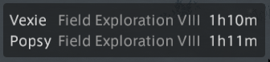
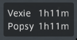

# Venture Bell

[](https://github.com/linusfr/ffxiv-venture-bell/actions/workflows/ci.yml)
[](LICENSE)

> Your retainers come back whether the game is open or not.

A venture timer is only useful while you are logged in, which is the one time you
do not need it. The plugin sends the completion times to a small server; the
server holds the countdown and pushes a notification — game closed, PC asleep,
you at work.

```text
┌─────────────────┐   "Sultana is back at 19:42,    ┌──────────────┐
│  Venture Bell   │    Bubbles at 19:43"            │  venturebell │
│  (Dalamud)      │   ────────────────────────────> │  (server)    │
└─────────────────┘   at the bell, then only        └──────┬───────┘
                      when something changes               │ 19:42
                                                           v
                                                       2 ventures complete
                                                       Sultana — Quick Exploration
                                                       Bubbles — Hunting Exploration
```

Every tag ships the plugin zip, the container image and the Helm chart at the
same version, so there is no compatibility matrix.

## Install

Add to Dalamud's custom plugin repositories (`/xlsettings` → Experimental):

```text
https://raw.githubusercontent.com/linusfr/ffxiv-venture-bell/main/pluginmaster.json
```

The two halves are independent, one settings tab each. **On-screen list** reads
the game and needs nothing else — no server, no account — so if that is all you
want, you are done. **Notifications** is the rest of this page.

Run the server (below), put its address and token into `/venturebell` — a green
dot means it answered — then add your Pushover credentials:
[register an application](https://pushover.net/apps/build), and paste its API
token and your user key into the plugin. "Send a test notification" proves both.

**The server holds no Pushover account.** Both halves live in the plugin and
travel with each sync, so a friend needs only the URL, the `BELL_TOKEN` and
their own Pushover setup — and nobody's ventures land on the operator's phone or
quota.

## Running the server

```sh
BELL_TOKEN=$(openssl rand -hex 24) ./venturebell
```

Docker: `ghcr.io/linusfr/ffxiv-venture-bell`, state on `/data`. Distroless and
uid 65532, so a bind mount needs `chown 65532:65532`; a named volume sorts
itself out.

```sh
kubectl create secret generic venturebell --from-literal=BELL_TOKEN=…
helm install venturebell oci://ghcr.io/linusfr/charts/venturebell \
  --version 2.0.0 --set existingSecret=venturebell
```

The chart pulls the image of the same version. Rendering fails outright without
a token; the rest is [`chart/values.yaml`](chart/values.yaml). GHCR publishes
new packages private, so a first pull may need the visibility flipped.

## Configuration

| Variable | Default | |
|---|---|---|
| `BELL_TOKEN` | *required* | Shared secret the plugin sends as `Authorization: Bearer …`. Everyone syncing to one server presents the same one, so hand it only to people you would also hand your Pushover quota |
| `BELL_ADDR` | `127.0.0.1:8770` | Listen address; the image overrides it to `0.0.0.0:8770` |
| `BELL_STATE` | `state.json` | Where the timers live; `/data/state.json` in the image |
| `BELL_LEAD` | `0` | Notify this long *before* completion, e.g. `5m` |
| `BELL_COALESCE` | `1m` | Completions this close together share one notification |
| `BELL_STALE` | `6h` | Missed by more than this and it is dropped, not sent late |
| `PUSHOVER_PRIORITY` | `-1` | Priority `-2`…`1` for every message this server sends; 2 needs an acknowledgement flow |
| `BELL_NOTIFY_START` | unset | Any value also announces ventures as they are assigned, with the time they are back |
| `TZ` | UTC | Zone for those times. The image carries its own tz database, so any IANA name works; the chart defaults to `Europe/Berlin` |
| `BELL_WEBHOOK_URL` | — | Also POST each notification as JSON here. The operator's relay, with no notion of a recipient, so on a shared server it sees everyone's |
| `BELL_DEBUG` | unset | Debug logging |

## How it behaves

- **Absolute times, not durations**, so a restart cannot skew the countdown
- **Each sync is the whole retainer list**, not an event: reassign a venture,
  dismiss a retainer, play an alt — the next sync is the truth
- **One message per batch.** When a venture comes due, anything finishing within
  `BELL_COALESCE` rides along. Nothing is sent early on its own
- **Nothing you can already see**, and nothing from last Tuesday: a venture that
  finished before the plugin synced is never pushed, and one missed by more than
  `BELL_STALE` is dropped
- **The plugin syncs when you close Timers or a summoning bell**, then every
  minute if something changed. The client has to ask the server for venture
  timers, and those windows are what asks — so after a game restart there is
  nothing to read. The list becomes a button that opens and closes Timers for
  you, which is all it takes
- **Start notifications are opt-in.** You are at the bell when you assign one,
  so the news is the time it is back. A character's first sync never announces
  starts — installing with eight running should not push eight "started"
- **One notification per destination**, grouped by the credentials each plugin
  registered. `/state` shows only *that* a character has some, never what they
  are: one shared `BELL_TOKEN` must not read out other people's
- **A failed notification is not retried forever.** Pushover gets three attempts,
  then an error in the log rather than a re-send all day

On screen, a small list shows what each retainer is doing and when it is back:



<details>
<summary>Without venture names</summary>



</details>

Minute resolution, because a venture is hours away. No title bar, no buttons,
click-through while locked, and out of the way in duties. It can be set to
appear only when a venture is back, or when all of them are. Text is a real font
size, 10–36px, so it stays sharp. "Move it" unlocks it for dragging and "Anchor
it here" puts it back; the position lives in the plugin's config, so it survives
reloads.

`/venturebell` opens the settings, `/venturebell sync` sends now,
`/venturebell status` reports the last attempt, `/venturebell window` toggles the
list. The settings window checks the connection whenever it opens, and every
button reports under "Last action".

## API

`POST /sync` replaces what the server knows about one character. `POST /test`
sends one notification with the credentials in the body, stores nothing, and
answers with Pushover's own error when a key is wrong. `GET /state` shows what
the server believes; `GET /healthz` is unauthenticated, for probes.

```jsonc
// Authorization: Bearer <BELL_TOKEN>
{
  "character": "Y'shtola@Phoenix",
  "retainers": [
    { "name": "Sultana", "venture": "Quick Exploration", "done_at": 1790283374 },
    { "name": "Coco" }
  ],
  "pushover": { "token": "axxxxxxxx", "user": "uxxxxxxxx" }
}
```

`done_at` is Unix seconds; omitting it means no venture is running. `pushover`
carries both halves or neither, and is replaced on every sync — a character
without it gets a log warning rather than a notification. A `BELL_WEBHOOK_URL`
receives `{title, message, completed[]}`.

## Development

```sh
just run          # the server on 127.0.0.1:8770
just sync 10      # pretend a bell: a retainer finishing in ten seconds
just install      # the plugin into ~/.xlcore/devPlugins for /xlplugins dev mode
just check        # everything CI runs
```

MIT. Not affiliated with Square Enix.
